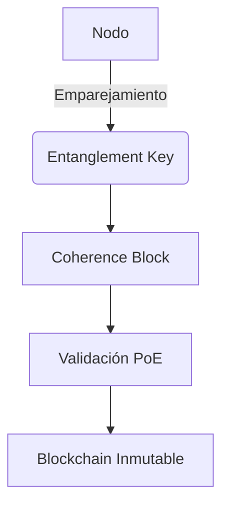

```
# 🌐 no-local-net: Blockchain con Proof of Entanglement (PoE)  
*Un protocolo de consenso revolucionario basado en entrelazamiento cuántico simulado.*  

---

## 📌 **Tabla de Contenidos**  
1. [Introducción](#-introducción)  
2. [Características Clave](#-características-clave)  
3. [Arquitectura del Sistema](#-arquitectura-del-sistema)  
4. [Mecanismo PoE Explicado](#-mecanismo-poe-explicado)  
5. [Instalación y Uso](#-instalación-y-uso)  
6. [API y Endpoints](#-api-y-endpoints)  
7. [Contribuir](#-contribuir)  
8. [Contacto](#-contacto)  

---

## 🚀 **Introducción**  
**no-local-net** es una blockchain descentralizada que utiliza **Proof of Entanglement (PoE)**, un consenso inspirado en propiedades cuánticas para validar transacciones sin necesidad de minería intensiva.  
- ✅ **Eficiencia energética**: No requiere POW.  
- ✅ **Seguridad criptográfica**: Entrelazamiento de bloques y nodos.  
- ✅ **Contratos inteligentes**: Ejecución en Python.  

---

## 🔥 **Características Clave**  
| Funcionalidad           | Descripción                                                                 |
|-------------------------|-----------------------------------------------------------------------------|
| **PoE Consensus**       | Validación mediante claves de coherencia y predicciones entrelazadas.       |
| **Smart Contracts**     | Soporte para contratos en Python con aislamiento de ejecución.              |
| **Wallet BIP-39**       | Generación de direcciones con mnemonics y soporte para tokens/NFTs.         |
| **Penalización de Nodos** | Mecanismo anti-spam con penalizaciones temporales.                         |

---

## 🏗️ **Arquitectura del Sistema**  


### **Componentes Principales**  
1. **Nodos**: Gestionan emparejamientos y predicciones.  
2. **Bloques de Coherencia**: Generan claves para validación.  
3. **Consenso**: Compara predicciones con hashes entrelazados.  

---

## ⚙️ **Mecanismo PoE Explicado**  
1. **Emparejamiento**:  
   - Cada nodo genera una `Entanglement Key` compartida con su par.  
2. **Predicción**:  
   - Los nodos calculan un hash combinando sus claves (`node_key + entangled_key`).  
3. **Validación**:  
   - El bloque se aprueba si el hash de la predicción coincide con la `Coherence Key`.  

**Fórmula de Validación**:  
```python
def validate_score(prediction, coherence_key):  
    return abs(prediction - coherence_key) <= margin_error  
```

---

## 📥 **Instalación y Uso**  

### **Requisitos**  
- Python 3.10+  
- Librerías: `fastapi`, `pydantic`, `coincurve`  

### **Pasos Rápidos**  
```bash
# Clonar repositorio  
git clone https://github.com/antsegang/no-local-net.git  
cd no-local-net  

# Instalar dependencias  
pip install -r requirements.txt  

# Iniciar nodo (puerto 5000)  
uvicorn app:app --port 5000  
```

### **Ejemplo de Transacción**  
```python
from classes.transaction import Transaction  
tx = Transaction(sender="Alice", receiver="Bob", amount=1.5, nonce=0)  
```

---

## 🔌 **API y Endpoints**  
| Endpoint                 | Método | Descripción                          |  
|--------------------------|--------|--------------------------------------|  
| `/run_node`              | POST   | Inicia un nodo.                      |  
| `/find_pair`             | GET    | Busca un nodo para emparejamiento.   |  
| `/blockchain`            | GET    | Devuelve la cadena completa.         |  
| `/add_transaction`       | POST   | Añade una transacción.               |  

---

## 🤝 **Contribuir**  
1. Haz fork del proyecto.  
2. Crea una rama: `git checkout -b feature/nueva-funcionalidad`.  
3. Envía un PR con tus cambios.  

**Requisitos para PRs**:  
- Documentación actualizada.  
- Tests unitarios (pytest).  

---

## 📧 **Contacto**  
- **Email**: absegura@no-local-net.ecolatam.com  
- **Sitio Web**: [no-local-net.ecolatam.com](https://no-local-net.ecolatam.com)  
- **Teléfono**: +506 8750-6376  
```

---