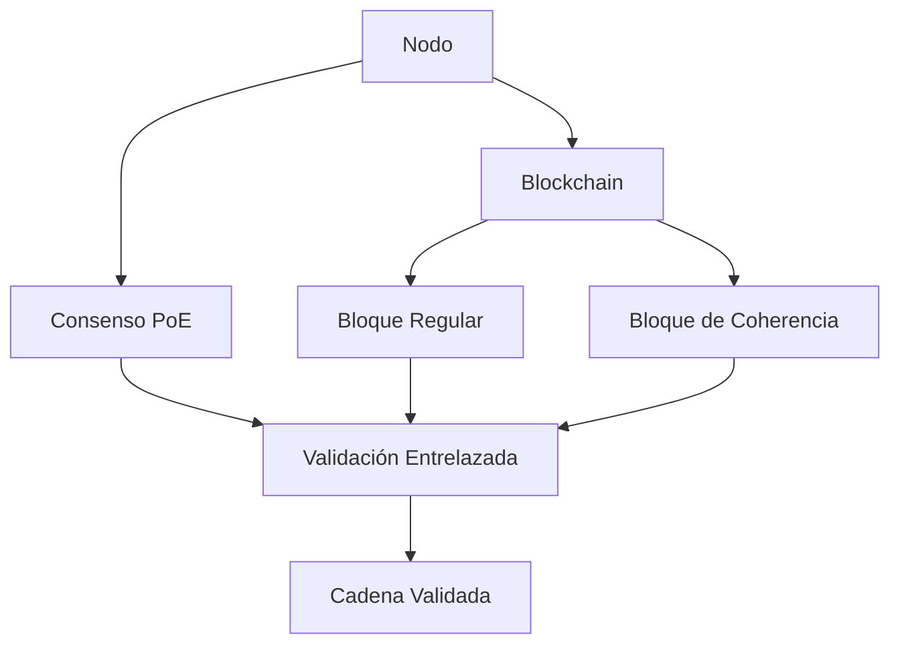

# 🌐 **no-local-net: Blockchain con Proof of Entanglement (PoE) - Documentación Técnica**

## 📖 **Tabla de Contenidos**
1. [Visión General](#-visión-general)
2. [Arquitectura del Sistema](#-arquitectura-del-sistema)
3. [Mecanismo de Consenso PoE](#-mecanismo-de-consenso-poe)
4. [Componentes Clave](#-componentes-clave)
5. [Flujo de Operaciones](#-flujo-de-operaciones)
6. [API y Endpoints](#-api-y-endpoints)
7. [Instalación y Configuración](#-instalación-y-configuración)
8. [Seguridad y Penalizaciones](#-seguridad-y-penalizaciones)
9. [Ejemplos de Uso](#-ejemplos-de-uso)
10. [Contribución](#-contribución)

---

## 🌟 **Visión General**

**no-local-net** es una implementación de blockchain que utiliza un innovador mecanismo de consenso llamado **Proof of Entanglement (PoE)**, inspirado en conceptos de entrelazamiento cuántico. A diferencia de los sistemas tradicionales como Proof of Work (PoW) o Proof of Stake (PoS), PoE:

- ✅ **Elimina la necesidad de minería intensiva**
- ✅ **Utiliza entrelazamiento criptográfico entre nodos**
- ✅ **Valida bloques mediante predicciones consensuadas**
- ✅ **Soporta contratos inteligentes nativos en Python**

**Características principales:**
- Protocolo de consenso basado en entrelazamiento nodal
- Sistema de penalización para nodos maliciosos
- Doble cadena de bloques (principal + coherencia)
- Generación de wallets compatibles con BIP-39

---

## 🏗 **Arquitectura del Sistema**

### **Diagrama de Componentes**


### **Capas Principales**
1. **Capa de Nodos**: Gestiona comunicación P2P y emparejamientos
2. **Capa de Consenso**: Implementa el algoritmo PoE
3. **Capa de Blockchain**: Almacena dos cadenas paralelas:
   - Cadena principal (transacciones)
   - Cadena de coherencia (claves de validación)
4. **Capa de Contratos**: Ejecución segura de smart contracts

---

## ⚙️ **Mecanismo de Consenso PoE**

### **Fases del Proceso**

1. **Emparejamiento de Nodos**:
   - Cada nodo encuentra un par (`entangled_pair_id`)
   - Generan claves entrelazadas (`key` y `entangled_pair_key`)

2. **Creación de Bloques**:
   ```python
   # En blockchain.py
   def create_block(self, node):
       block = Block(index, prev_hash, transactions)
       coherence_block = CoherenceBlock(block, node)
       entangled_hash = hash(block.hash + coherence_block.hash)
       return block, coherence_block, entangled_hash
   ```

3. **Generación de Predicciones**:
   - Cada nodo calcula una predicción usando:
     ```python
     # En consensus.py
     def generate_node_prediction(node_key, pair_key):
         return hash(node_key + pair_key + nonce) % 100000
     ```

4. **Validación Consensuada**:
   - Comparación con la `coherence_key` del bloque de coherencia
   - Tolerancia del 10% (configurable)

5. **Minería del Bloque**:
   - El nodo con la predicción más cercana gana el derecho a minar
   - Se añade a ambas cadenas (principal y coherencia)

---

## 🔧 **Componentes Clave**

### **1. Nodo (`node.py`)**
- Gestiona:
  - Comunicación P2P
  - Estado de la blockchain
  - Emparejamientos
  - Penalizaciones

**Estructura principal:**
```python
class Node(BaseModel):
    node_id: str
    ip: str
    port: int
    blockchain: Blockchain
    peers: Dict[str, str]
    entangled_pair_id: Optional[str]
    key: Optional[int]
    # ... (otros campos)
```

### **2. Blockchain (`blockchain.py`)**
- Mantiene dos cadenas paralelas:
  - `chain`: Bloques regulares
  - `coherence_chain`: Bloques de validación
- Lógica de creación de bloques génesis

### **3. Bloques**
- **Bloque Regular (`block.py`)**:
  ```python
  class Block(BaseModel):
      index: int
      previous_hash: str
      transactions: List[Transaction]
      hash: str
  ```
  
- **Bloque de Coherencia (`coherence_block.py`)**:
  ```python
  class CoherenceBlock(BaseModel):
      coherence_key: int
      node_key: int
      entangled_node_key: int
      # ... (otros campos)
  ```

### **4. Consenso (`consensus.py`)**
Implementa las reglas PoE:
```python
class EntanglementConsensus:
    def validate_score(self, prediction, hashed_key):
        return abs(prediction - hashed_key) <= margin_error
    # ... (otros métodos)
```

---

## 🔄 **Flujo de Operaciones**

1. **Inicialización**:
   ```bash
   uvicorn app:app --port 5000
   ```

2. **Emparejamiento**:
   ```python
   POST /entanglement_request
   {"remote_peer_id": "node_123"}
   ```

3. **Transacción**:
   ```python
   POST /add_transaction
   {"sender": "A", "receiver": "B", "amount": 1.5}
   ```

4. **Consenso**:
   - Cuando se alcanza el límite de transacciones:
     - Generación de bloques
     - Creación de predicciones
     - Validación consensuada

5. **Minería**:
   - El nodo ganador propaga el bloque
   - Los demás nodos validan y sincronizan

---

## 📡 **API y Endpoints**

| Endpoint                 | Método | Descripción                              |
|--------------------------|--------|------------------------------------------|
| `/run_node`              | POST   | Inicia un nodo                           |
| `/node_info`             | GET    | Obtiene información del nodo             |
| `/find_pair`             | GET    | Busca nodo para emparejar                |
| `/blockchain`            | GET    | Devuelve toda la blockchain              |
| `/add_transaction`       | POST   | Añade una transacción                    |
| `/validate_blockchain`   | GET    | Valida la integridad de la blockchain    |

**Ejemplo de llamada:**
```python
import requests
response = requests.post('http://localhost:5000/add_transaction', 
                         json={"sender": "A", "receiver": "B", "amount": 1.0})
```

---

## 🛠 **Instalación y Configuración**

### **Requisitos**
- Python 3.10+
- Dependencias:
  ```bash
  pip install fastapi pydantic coincurve requests
  ```

### **Configuración**
1. Clonar repositorio:
   ```bash
   git clone https://github.com/antsegang/no-local-net.git
   ```
2. Iniciar nodo:
   ```bash
   uvicorn app:app --port 5000 --reload
   ```
3. Conectar peers:
   ```python
   POST /receive_peers
   {"peer_id": "http://otro_nodo:5000"}
   ```

---

## 🔒 **Seguridad y Penalizaciones**

### **Mecanismo Anti-Spam**
- **Penalizaciones**:
  - 10 minutos de timeout tras 3 intentos fallidos
  - Registro en `penalized_nodes`

**Código relevante (node.py):**
```python
if len(pending_transactions) < limit:
    penalized_nodes[node_id] = time.time()
    times_penalized[node_id] += 1
```

### **Validaciones Clave**
1. Firmas digitales en transacciones
2. Coherencia entre cadenas
3. Emparejamientos verificados

---

## 💻 **Ejemplos de Uso**

### **1. Crear Wallet**
```python
wallet = Wallet()
print(wallet.address)  # Ej: ΦxAbCdEf123...
```

### **2. Enviar Transacción**
```python
tx = Transaction(
    sender="Alice",
    receiver="Bob",
    amount=5.0,
    nonce=0
)
node.add_transaction(tx)
```

### **3. Consultar Blockchain**
```python
GET /blockchain
# Devuelve estructura JSON con ambas cadenas
```

---

## 🤝 **Contribución**

**Guía para contribuir:**
1. Reportar issues en GitHub
2. Hacer fork y crear ramas descriptivas
3. Enviar PRs con:
   - Tests actualizados
   - Documentación modificada

**Estándares de Código:**
- Type hints en todas las funciones
- Logging consistente (usar `logger` global)
- Docstrings al estilo Google

---

## 📬 **Contacto**

Para más información:
- **Email**: absegura@no-local-net.ecolatam.com
- **Sitio Web**: [no-local-net.ecolatam.com](https://no-local-net.ecolatam.com)
- **Teléfono**: +506 8750-6376

**Licencia**: Creative Commons BY-NC-ND 4.0